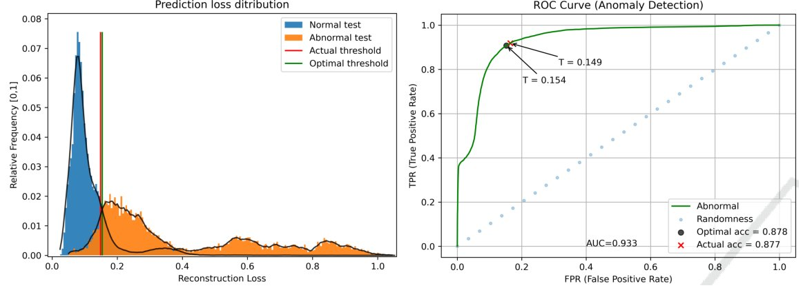

.. Places parent toc into the sidebar
:parenttoc: True

.. _anomaly_detection:

=========================
Anomaly Detection
=========================

.. currentmodule:: emlearn

Anomaly Detection is the task of identifying samples that are *abnormal* / *anomalous*,
meaning that they deviate considerably from some *normal* / *typical* data.
The task is highly related to **Outlier Detection** and **Novelty Detection**. 
Many of the tools and techniques mentioned here can be transferred directly to those tasks.

Anomaly Detection is normally approached as an unsupervised learning problem,
with the training data consisting only of normal data (potentially with a low degree of contamination).
Any deviation from this normal training data is to be considered an *anomaly*.
This is sometimes called *one-class classification*, as it focuses on modeling a single class (the normal class).

The one-class approach ensures that *novel* anomalies (different from those seen during development),
are correctly classified as anomalies.
If one would use a supervised binary classification, it usually has the problem that novel datapoints
may be incorrectly marked as normal, because they falls inside a decision boundary in training set.

While labeled data is not used in the training set when applying unsupervised learning,
in practice a small labeled dataset is critical for performance evaluation.

Applications
===========================
Anomaly Detection has wide range of applications
using sensor data and embedded systems.
Here are a few examples.

.. table:: Application examples
    :widths: auto

    ============    =================================================                       ============
      Area          Task                                                                    Sensor 
    ============    =================================================                       ============
    Industrial      Condition Monitoring of rotating machninery                             Accelerometer
    Industrial      Detecting fault in machines                                             Microphone
    Electronics     Detecting issues in Lithium Ion batteries                               Electrical/thermal
    Automotive      Instrusion and fault detection in CANBus networks                       CANBus
    Robotics        Monitoring executed tasks for faults                                    Mix
    Health          Detection of anomalous heartbeats                                       Electrocardiogram (ECG)      
    ============    =================================================                       ============

Trade-off between False Alarms and Missed Detections
===========================

Anomaly Detection involves a binary decision problem (is it an anomaly or not),
has an inherent trade-off between False Alarms and Missed Detections.

Anomaly Detection models in emlearn provide a continuous anomaly score as output.
The C function has a name ending with  ``_score()``
A threshold needs to be applied, in order to convert the continuous anomaly score
to a binary decision.

Selecting anomaly threshold 
===========================

Models in scikit-learn have an automatic threshold selection,
based on the hyperparameter `contamination` (proportion of outliers in training data).
We recommend **not** using this mechanism, but instead analyze the continuous anomaly scores
to determine an appropriate threshold.
It is smart to plot the histogram over anomaly scores, with the anomaly/normal class indicated (when known).

    The anomaly score histogram is very useful plot to visualize.
    When labels are available, it is also possible to compute a trade-off curve.
    Image source: "Robust Anomaly Detection in Time Series through Variational AutoEncoders and a Local Similarity Score", Matias et.al., 2021.

The optimal way of setting the threshold, is to use a labeled validation dataset.
It is then possible to pick a desired false positive vs false negative trade-off,
(for example using f-score), and to determine an optimal threshold.

When the labeled data is insufficient or not present,
one has to resort to other heuristics for selecting the threshold.
This is often done visually, by picking a point where "most of" the "normal" data look to be included.

.. TODO: link to example for illustrating scores and setting threshold

Anomaly Detection models
===========================

emlearn supports a selection of Anomaly Detection models.

.. table:: Supported models for Anomaly Detection
   :widths: auto
   
   ============================     ======
   Algorithm                        Implementation
   ============================     ======
   Gaussian Mixture Model (GMM)     `GaussianMixture <https://scikit-learn.org/stable/modules/generated/sklearn.mixture.GaussianMixture.html>`_, `BayesianGaussianMixture <https://scikit-learn.org/stable/modules/generated/sklearn.mixture.BayesianGaussianMixture.html>`_
   Mahalanobis distance             `EllipticEnvelope <https://scikit-learn.org/stable/modules/generated/sklearn.covariance.EllipticEnvelope.html>`_
   ============================     ======

A basic example of some of the models can be found in
:ref:`sphx_glr_auto_examples_anomaly_detection.py`.

Outlier detection for handling unknown data
===========================

Anomaly/outlier detection models are also used in :doc:`classification` or :doc:`regression` systems,
in order to detect input data that are outside the data distribution of a trained model.
Such input data can result in spurious results from the classifier/regressor.
To prevent this the input data is also passed through an outlier detection model,
and the outliers are marked as "unknown".

.. TODO: link to example with outlier detection of OOD handling

.. TODO: write section on combined detection + classification.
.. Ex: fault diagnostics, fault localization et.c.

