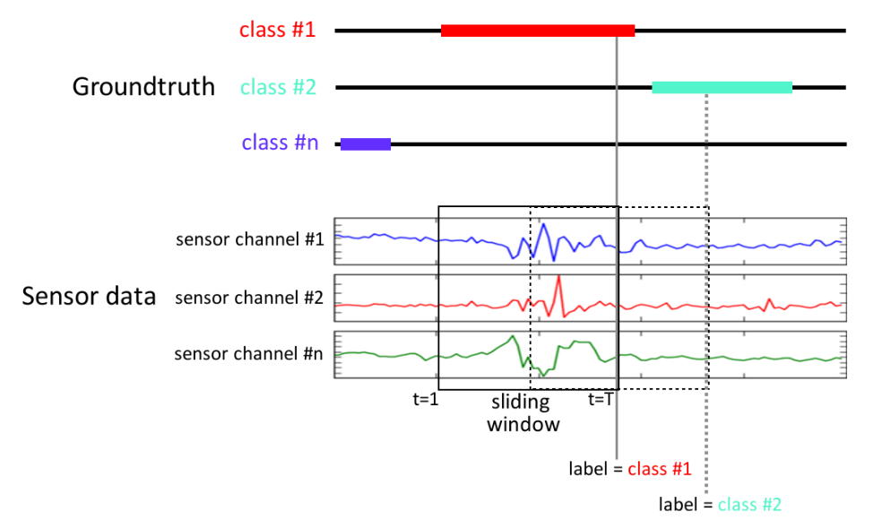
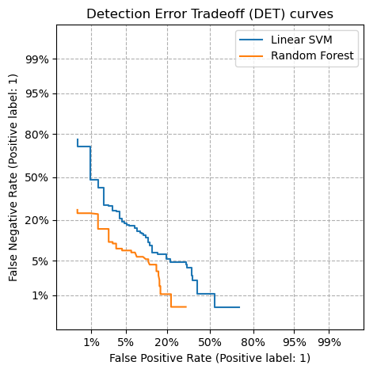

.. Places parent toc into the sidebar
:parenttoc: True

.. _event_detection:

=========================
Event Detection
=========================

.. currentmodule:: emlearn

An *event* is some phenomena that has a distinct temporal pattern.
In the simplest case there is a distinct *start* of the event (often called an onset),
and a distinct *end* of the event (offset).
But sometimes the end (or start) is a gradual or indistinct transition.
More rarely, both the start and end are gradual - like the sound of a car passing by.

Often we are interested in detecting the *time* when the events start and end,
*counting* the number of events, calculating the event *durations*,
and sometimes classifying the *type* of event.
This need for fine-grained information about start/end time and discrete (countable) events,
is one of the key elements that separates event detection from standard classification.

Event Detection is usually approached as a supervised learning task,
and requires that the dataset has a labeled set of events (with start, end and class).

Applications
===========================
Detecting events using Machine Learning has a wide range of applications,
and it is commonly performed on sensor data using embedded systems.

.. table:: Application examples
    :widths: auto

    ============    =============================       ============
      Area          Task                                Sensor 
    ============    =============================       ============
    Ecology         Birdcall detection                  Sound
    Music           Note onset detection                Sound
    Speech          Voice Activity Detection            Sound
    Health          Gait tracking during walking        Accelerometer
    Health          Heart rate monitoring               Optical reflectometer
    Health          Epelepsy seizure                    EEG
    Health          Sleep apnea event detection         Accelerometer
    ============    =============================       ============

                  
Binary or multi-class
===========================

Event Detection is often binary (the target event is either present or not),
but it may also be multi-class (multiple event types that can each be present or not).
In a multi-class setting, all the event classes can be handled by a single multi-class detector,
or each event class can be modeled using an independent binary event detector model.

.. TODO: mention model cascading 
.. Event Detection is sometimes part of larger systems.
.. Sometimes it is a first-stage detector before performing more computationally intensive tasks such as classification.
.. Or sometimes event counts and durations are used as features for higher-level models. 

Sliding time windows
===========================

The continuous input time-series data is usually transformed into a series of fixed-length feature vectors.
Individual features vector for one time-step is often referred to as a *frame*.
Multiple frames are often combined to form a context *window*, consisting of N frames.
This is often referred to as using *sliding windows* or *moving windows*,
or using a *continious classification* approach.

    The training setup for Event Detection as a continious classification problem.
    The input sensor data is split into fixed-length windows, and the label comes from the event annotations.
    Image source: "Deep Convolutional and LSTM Recurrent Neural Networks for Multimodal Wearable Activity Recognition" (Roggen et al., 2016)

The distance between windows is known as the *hop length*.
This is normally smaller than the size of the window (*window length*),
so effectively there is a degree of *overlap* between consecutive windows.
The overlap might be as low as 50%, or as high as 99%.
This ensures that the model sees the events during training at multiple different positions inside the window.
And a high overlap during inference can give multiple predictions per event,
which can be merged together to give a better estimate than a single prediction.

The window length is an important hyperparameter for event detection,
and is preferably tuned through to the task at hand via experimentation.
A good starting point is that windows are large enough to easily cover
the transition between event and not (onset/offset).

The hop length decides the time resolution of the output predictions/activations,
and must be set based on the precision requirements for the task. 

The sliding-window computation is usually done in combination with :doc:`feature_extraction`.

.. emlearn provides the SignalWindower tool to perform this operation.
.. TODO: describe the SignalWindower tool in emlearn
.. TODO: link to examples of signal windowing

Classification models for Event Detection
===========================

The use of the sliding window approach in combination with feature engineering
makes it possible to use any standard machine learning classifier for event detection.
For an overview of available classifiers see :doc:`classification`.

Training with class imbalance
===========================

Event detection problems usually have a considerable *class imbalance*:
Events are usually quite rare versus no-event.
This may need to be accounted for during training to get a well performing model.

One approach is to balance the classes.
This is done either by oversampling the minority class,
undersampling the majority class, or a combination.
The `imbalanced-learn <https://imbalanced-learn.org/>`_ library provides tools for this.

Some models also support adjusting the optimization objective in ways that can
be used to counteract class imbalance problems.
This can be in terms of a *class weights* or *sample weights*.
Examples of models supported by emlearn with these capabilities are
`RandomForest <https://scikit-learn.org/stable/modules/generated/sklearn.ensemble.RandomForestClassifier.html>`_,
and `keras.Sequential <https://keras.io/api/models/model_training_apis/#fit-method>`_.

.. _binary_detection_tradeoff:

Trade-off between False Alarms and Missed Detections
===========================

Event Detection involves a binary decision problem (is it an event or not),
has an inherent trade-off between False Alarms and Missed Detections.
Different usecases and applications often have a different preference for the
preferred balance between these two.

It is useful to visualize the trade-offs that are possible for a given model/system.
There are a number of standard plots used for this purpose, such as:

- Detection Error Trade-off (DET) curve
- Receiver Operating Characteristic (ROC) curve
- Precision-Recall (PR) curve

    A Dection Error Curve (DET) is useful to visualize the tradeoff between False Positive and False Negative,
    as well as compare the performance of multiple models against eachother.

scikit-learn has utilities to produce these, with several examples on
`Precision-Recall curves <https://scikit-learn.org/stable/auto_examples/model_selection/plot_precision_recall.html>`_
and `DET and ROC curves <https://scikit-learn.org/stable/auto_examples/model_selection/plot_det.html>`_.

The operating point along such a curve is set by applying a decision threshold on top of a continuous output.
Most classification models in emlearn support such a continuous output with a ``predict_proba()`` function.

Evaluation metrics
===========================

There are several evaluation metrics that are commonly used for event detection.

Some compare performance at a particular operating point / threshold:

- F-score (F1, F-beta, etc.) 
- Precision/Recall
- False Positive Rate (FPR) / False Negative Rate (FNR)
- False Acceptance Rate (FAR) / False Rejection Rate (FRR)

Others compare performance across the operating range:

- Area Under Curve Precision-Recall (AUC-PR)
- Average Precision (AP)

.. Precision @ Recall X
.. Equal Error Rate EER

Metrics may be computed either per frames or analysis window (*frame-wise*), or *event-wise*.

Frame-wise evaluation
===========================

Frame-wise evaluation is readily done using the `standard metrics <https://scikit-learn.org/stable/modules/model_evaluation.html#model-evaluation>`_,
as each frame or window is one *instance*/*sample* for the model to predict on,
and the prediction is compared with its corresponding label in the same way as standard classification.

However sometimes we do not need each and every frame to be correct.
For example we may tolerate a bit of slop in the onset and offset.
Especially since the groundtruth labels themselves may have some imprecision.
In the case, the results of frame-wise evaluation may underestimate practical performance.

Event-wise evaluation
===========================

Event-wise evaluation is often closer to the practical performance.
It allows to specify some tolerance in time,
and whether to evaluate only based on onsets, or also offsets/duration.
However, event-wise evaluation is not as commonly supported in standard machine learning toolkits.
But one can implement it using a module such as `sed_eval <http://tut-arg.github.io/sed_eval>`_.

.. Future
.. TODO: add section on post-processing 
.. TODO: add image/link to some examples/demos

