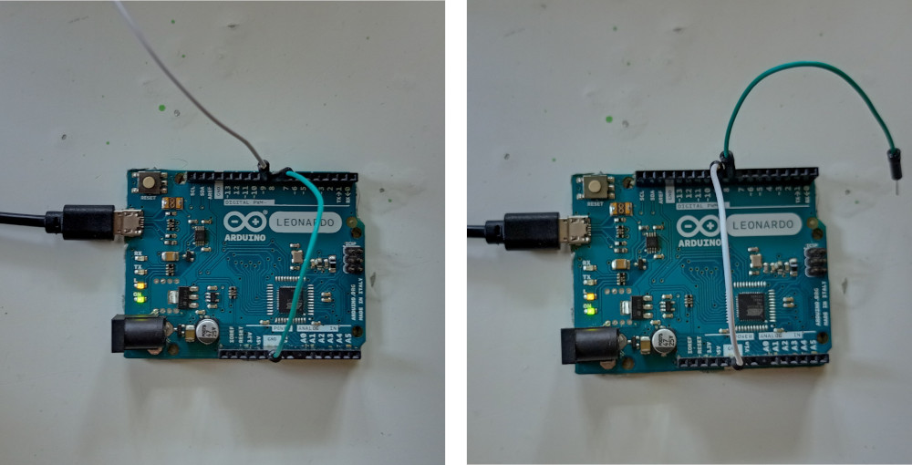
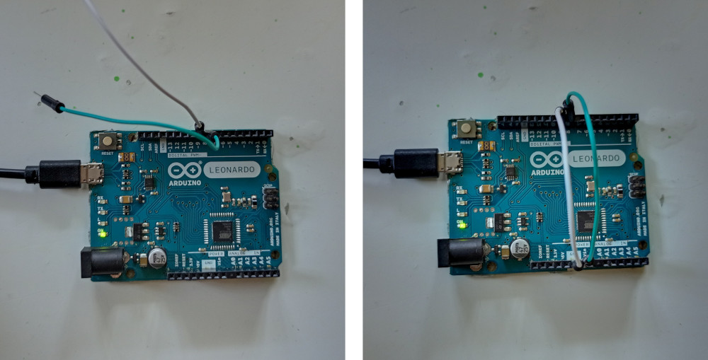

.. Places parent toc into the sidebar

:parenttoc: True

.. _getting_started_arduino:

=========================
Getting started on hardware (Arduino)
=========================

.. currentmodule:: emlearn

emlearn works on any hardware that has C99 support.
One very easy way to start testing it out is using the Arduino platform.

Prerequisites
===========================

Ensure that you have **emlearn** setup as per the :doc:`getting_started_host`. 

You will also need to have the `Arduino IDE <https://www.arduino.cc/en/software>`_ installed,
and some Arduino-compatible hardware.

Any Arduino compatible board should work,
as the code only uses basic I/O functions such as ``digitalRead()`` / ``analogRead()`` and ``digitalWrite()``.

Create Arduino project
========================

To run our model we use a simple Arduino sketch.
It reads data from digital/analog inputs,
and shows the output of the model on a LED.

Open the Arduino IDE, and create a new sketch.
Save the sketch to a folder, for example ``emlearn_helloworld_xor``.

Replace the sketch code in the Arduino IDE with the contents of the following.

.. literalinclude:: helloworld_xor/helloworld_xor.ino
   :language: c
   :emphasize-lines: 1,18-19
   :linenos:

Wait with compiling, as we will need the generated C code from the next step.

Create model in Python
===========================

We will train a simple model to learn the XOR function.
Copy and save this as file ``xor_train.py``.

.. literalinclude:: helloworld_xor/xor_train.py
   :language: python
   :emphasize-lines: 1,21-24
   :linenos:

Run the script

.. code-block:: console

    python xor_train.py

It will generate a file ``xor_model.h`` containing the C code for our model.

Copy model files into Arduino
=============================

Copy the ``xor_model.h`` file into your **sketch** folder.

Install emlearn as Arduino library
=============================

Run the following code to install the ``emlearn`` library
into the Arduino library folder.

.. code-block:: console

    python -m emlearn.arduino.install

It should output something like "Installed emlearn to C:\\Users\me\Documents\Arduino\libraries\emlearn".
Note that the exact path will vary based on your username and operating system.

Build and upload the code
========================

Now that the sketch code and the included files are in place,
you can do **Upload** in the Arduino IDE.

Test it out 
========================

The XOR function, if **one and only one** input is true, should get class **1** as output - else class **0**. 
In our XOR training data input values above ``0.5`` is considered "true".
For an analog pin that means above halfway in its voltage range.
For a digital pin there are only two possible states. High is true, and low is false.

The following should output 1 (LED on)

.. code-block:: console

    A     B
    high  low
    low   high

The following should output 0 (LED off)

.. code-block:: console

    A     B
    high  high
    low   low

Next
========

Now that you have tested emlearn on some real hardware,
you are ready to develop your application for your particular hardware.

.. TODO: link to guide for PlatformIO

