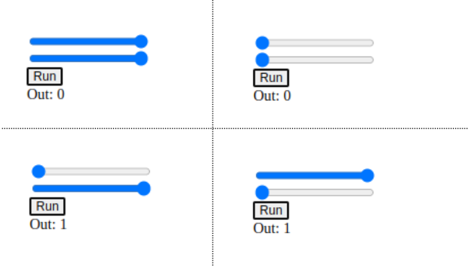

.. Places parent toc into the sidebar

:parenttoc: True

.. _getting_started_browser:

=========================
Getting started on browser (WASM/Emscripten)
=========================

.. currentmodule:: emlearn

emlearn models work anywhere there is a C99 compiler available.
This includes running client-side in a web browser,
by using a compiler like Emscription to target `WebAssembly (WASM) <https://en.wikipedia.org/wiki/WebAssembly>`_.

emlearn is primarily designed for very compute and size constrained microcontrollers.
This makes it good for making very small models,
which is a benefit also in the browser, in order to minimize download time. 
Furthermore using a browser can be very useful when developing embedded systems,
as it enables making demonstrations and tools that are very accessible,
while re-using the same code that is deployed on-device.

Prerequisites
===========================

You need to have installed **Python** (version 3.6+),
and the `Emscripten toolchain <https://emscripten.org/docs/getting_started/downloads.html>`_.

This guide assumes that you have basic familiarity with web development.

.. note::

    We will be showing some shell commands below.
    These will assume that a bash-compatible shell is used.
    For cmd.exe, Powershell et.c the commands may need to be adjusted somewhat.

Install scikit-learn
===========================

In this example, **scikit-learn** is used to train the models.

.. code-block:: console

    pip install scikit-learn

Install emlearn
===========================

**emlearn** will be used to convert the scikit-learn models to C code.

.. code-block:: console

    pip install emlearn

Create model in Python
===========================

We will train a simple model to learn the XOR function.
The same steps will be used for model of any complexity.
Copy and save this as file ``xor_train.py``.

.. literalinclude:: helloworld_xor/xor_train.py
   :language: python
   :emphasize-lines: 1,16-17
   :linenos:

Run the script

.. code-block:: console

    python xor_train.py

It will generate a file ``xor_model.h`` containing the C code for our model.

Use in C code for WASM module
========================

To run C code in a browser, we need to build it as a WebAssembly (WASM) module.
For that we will use Emscripten.

Copy and save this as file ``xor_browser.c``.

.. literalinclude:: helloworld_xor/xor_browser.c
   :language: c
   :emphasize-lines: 1,16,17
   :linenos:

Compile the C code to WASM using Emscripten.

.. code-block:: console

    export EMLEARN_INCLUDE_DIR=`python -c 'import emlearn; print(emlearn.includedir)'`
    emcc xor_browser.c -o xor_browser.js \
        -sALLOW_MEMORY_GROWTH=1 \
        -sEXPORTED_FUNCTIONS=_run_xor_model,_malloc,_free \
        -I${EMLEARN_INCLUDE_DIR}

The setting `ALLOW_MEMORY_GROWTH` is needed to support `malloc`,
which is used to allocate space for the input data.
And all C functions which we want to call needs to be added
to `EXPORTED_FUNCTIONS` (with an underscore in front).

Load WASM module in webpage
========================

Now we will set up a small webpage where we will use the model.

Copy and save this as file ``xor_browser.html``.

.. literalinclude:: helloworld_xor/xor_browser.html
   :language: c
   :emphasize-lines: 4-5,27-28,39-40
   :linenos:

Try it out 
========================

Run a web server, which will serve the ``xor_browser.html`` file

.. code-block:: console

    python -m http.server

Open browser and navigate to `localhost:8000/xor_browser.html <http://localhost:8000/xor_browser.html>`_.
You should see a webpage with two sliders.
When changing the input values using the slides, the JavaScript will call the xor_browser.c via WASM.
This runs the model built with emlearn, which classifies the data.
The result is written to the "Out" element. 

In our training data input values above ``0.5`` is considered "true".
So for the XOR function, if **one and only one** of the values is above ``0.5``,
should get class **1** as output - else class **0**. 

Next
========

Now you have the emlearn setup, that can build browser-based applications.

You may be interested in trying it out on a hardware device.
See for example :doc:`getting_started_arduino`.

.. TODO: add data input sections for browser
.. Maybe as separate pages from getting started?
.. Minimum would be a page that just describes relevant capabilities,
.. and links to relevant documentation elsewhere
.. Better would be example code that can be copy-pasted to start
.. Ideal would be runnable demos that shows how to solve a typical task 
..
.. TODO: add a section on audio input / microphone with  WebAudio 
.. https://emscripten.org/docs/api_reference/wasm_audio_worklets.html
.. also how to load/process an audio clip?
..
.. TODO: add a section on accelerometer IMU input with 
.. https://developer.mozilla.org/en-US/docs/Web/API/Accelerometer
.. https://developer.mozilla.org/en-US/docs/Web/API/LinearAccelerationSensor
.. https://developer.mozilla.org/en-US/docs/Web/API/Gyroscope
..
.. TODO: add a section on webcam input using MediaDevices
.. https://developer.mozilla.org/en-US/docs/Web/API/MediaDevices
.. also how to load/process an image
..

